# Model Frontend Architecture

Current frontend design for the rebuilt `src/models` stack.

## Feature Layout

OHLCV input uses `f0..f8`:

```text
f0 = return
f1 = range
f2 = close_position
f3 = limit_band_position
f4 = volume_ratio          # clamp to [0, 10]
f5 = signed_amihud
f6 = limit_state_id        # 0..15
f7 = sin(time)
f8 = cos(time)
```

Sidechain currently keeps:

```text
gap
gap_rank
mf_net_ratio
mf_net_rank
mf_concentration
amount_rank
velocity_rank
amihud_impact
```

## Branch Split

```text
Path core    = {f0, f1, f2, f3}
Liquidity    = {f4, f5}
Status       = {f6}
Time         = {f7, f8}
Sidechain    = {gap, gap_rank, mf_net_ratio, mf_net_rank, mf_concentration, amount_rank, velocity_rank, amihud_impact}
```

## Design Rules

1. `f0-f3` use per-feature WNO encoders.
2. `f7-f8` do not enter the WNO operator directly.
3. `f7-f8` are injected after WNO in the path branch, and directly projected in the liquidity/state branches.
4. Path branch uses explicit pairwise crosses only for Tier 1 and Tier 2 pairs.
5. Liquidity branch keeps `R = clamp(f4, 0, 10)` as explicit magnitude.
6. `f4` also produces an RBF encoding `e4` for FiLM conditioning.
7. `f5` uses `SymLog + Fourier(num_freqs=2)`.
8. Liquidity should remain as tokenized sequence output, not a single early-pooled vector.
9. Price and liquidity should perform symmetric dual fusion and then build a `Kp x Kv` joint interaction grid.
10. `f6` is a discrete hard state anchor. It should read from the `price-liquidity joint tokens`, not directly from raw liquidity memory.
11. State and liquidity outputs should remain separate unless a later stage explicitly needs interaction.
12. Sidechain should preserve directional semantics: `moneyflow <-> liquidity -> gap`.
13. Sidechain cross-group interaction should not use symmetric self-attention as the main structure.
14. Sidechain should write into `Z_joint` through gated cross-attention and block conditioning, not through an early head override.
15. Cross-scale fusion should use a mezzo-centric route, not full three-scale all-to-all attention.
16. The cross-scale route is: `macro -> mezzo -> micro -> mezzo -> FFN(mezzo)`.
17. `micro -> mezzo` should use a stronger selection module than dense cross-attention.

## Frozen Hyperparameters

The first implementation fixes all structural sizes to keep tensor shapes static
and CUDA Graph friendly:

```text
D   = 64
heads = 4

Kp  = 4   # path tokens
Kv  = 3   # liquid tokens
Kj  = 4   # joint tokens
Ks  = 4   # side tokens

topk = 4

macro_wno_blocks = 2
mezzo_wno_blocks = 2
micro_wno_blocks = 2

macro_wno_levels = 2
mezzo_wno_levels = 2
micro_wno_levels = 2
```

## Pairwise Cross Set

Tier 1:

```text
(f0, f1)
(f0, f2)
(f1, f2)
```

Tier 2:

```text
(f0, f3)
(f1, f3)
```

Each pair keeps:

```text
prod
diff
absdiff
```

So the path token set is:

```text
4 single-feature tokens
+ 5 pairs * 3 cross-types
= 19 tokens
```

## Frontend Network Overview

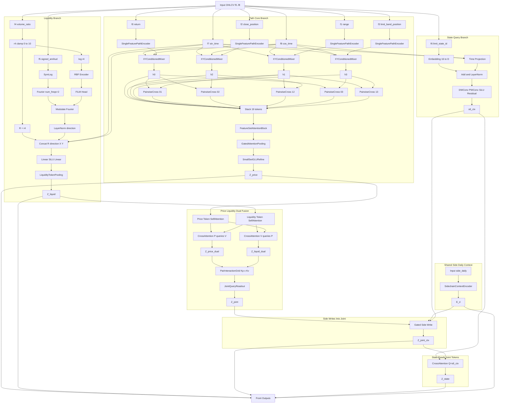

## Sidechain Causal Semantics

```text
moneyflow <-> liquidity -> gap
```

Interpretation:

- `moneyflow` and `liquidity` are mutually verifying causes.
- `gap` is a downstream result / manifestation.
- `E_d` should preserve this direction, not flatten the three groups into one symmetric context token.

## Sidechain Group Split

```text
GapState         = {gap, gap_rank}
MoneyFlow        = {mf_net_ratio, mf_net_rank, mf_concentration}
LiquidityRegime  = {amount_rank, velocity_rank, amihud_impact}
```

## Sidechain Output Rule

Do not collapse sidechain into a single token too early.

Instead:

```text
E_d = stack([z_mf1, z_liqreg1, z_cause, z_gap_ctx], dim=token_axis)
```

with:

- `z_mf1`: moneyflow token after reading liquidity
- `z_liqreg1`: liquidity-regime token after reading moneyflow
- `z_cause`: fused latent from `moneyflow <-> liquidity`
- `z_gap_ctx`: gap token after reading `z_cause`

So the sidechain output is:

```text
E_d: [B, Td, 4, D]
```

Recommended use:

```text
E = E_d
delta_J = CrossAttn(Q=Z_joint, K,V=E)
alpha_evt = sigmoid(MLP([Pool(s6_ctx), Pool(E), Pool(Z_joint)]))
Z_joint = Z_joint + alpha_evt * delta_J
```

Optional block conditioning:

```text
[gamma, beta, g_attn, g_ffn] = SideStateMLP([Pool(E), Pool(s6_ctx)])
Z_joint = Z_joint + g_attn * SelfAttn(AdaLN(Z_joint, gamma, beta))
Z_joint = Z_joint + g_ffn  * FFN(AdaLN(Z_joint, gamma, beta))
```

Do not use sidechain as a separate early override head in the first version.

## Module Graphs

### SingleFeaturePathEncoder

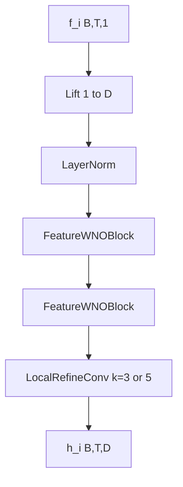

### FeatureWNOBlock

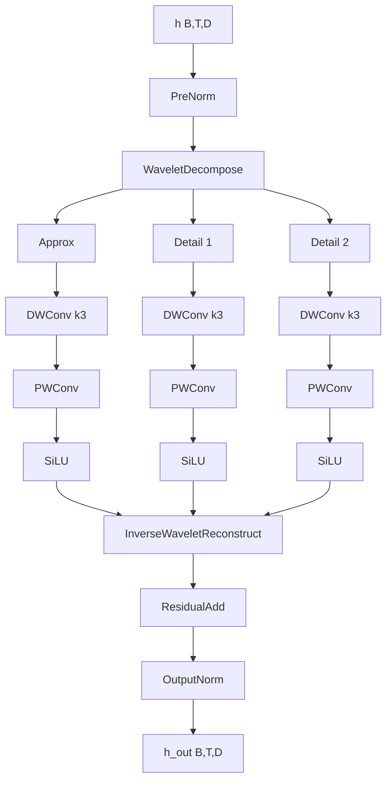

### XYConditionedMixer

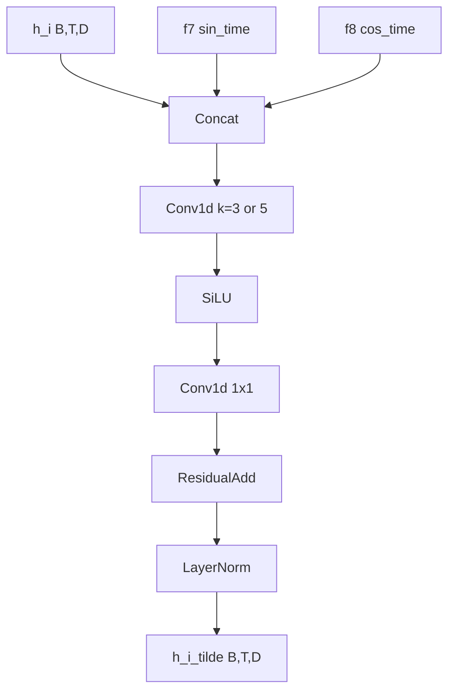

### PairwiseCross

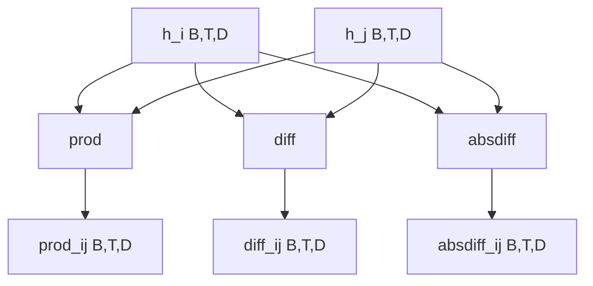

### FeatureSetAttentionBlock

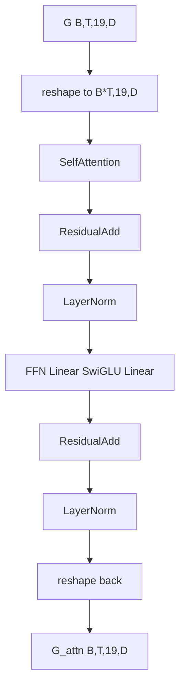

### GatedAttentionPooling

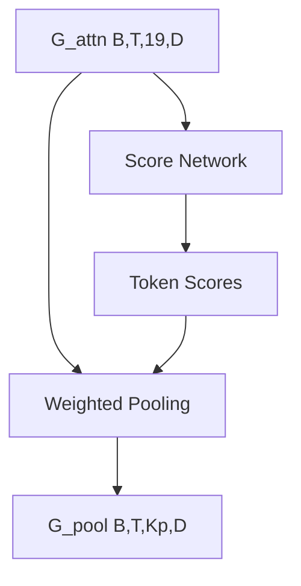

### SmallSwiGLURefine

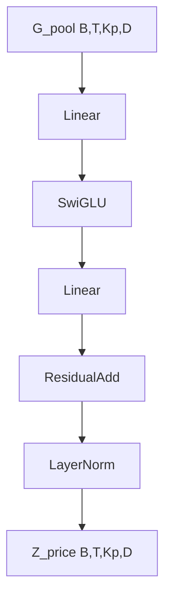

### Liquidity Branch

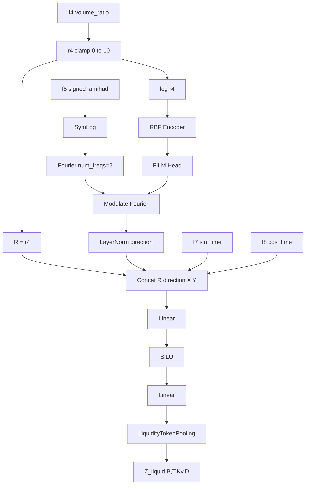

### LiquidityTokenPooling

`Z_liquid_base_seq` below is the pre-pooling sequence produced by the preceding
`Linear -> SiLU -> Linear` block in the liquidity branch.

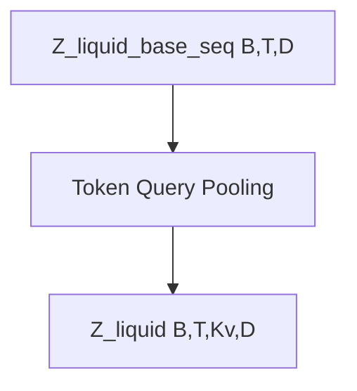

### StateQueryEncoder

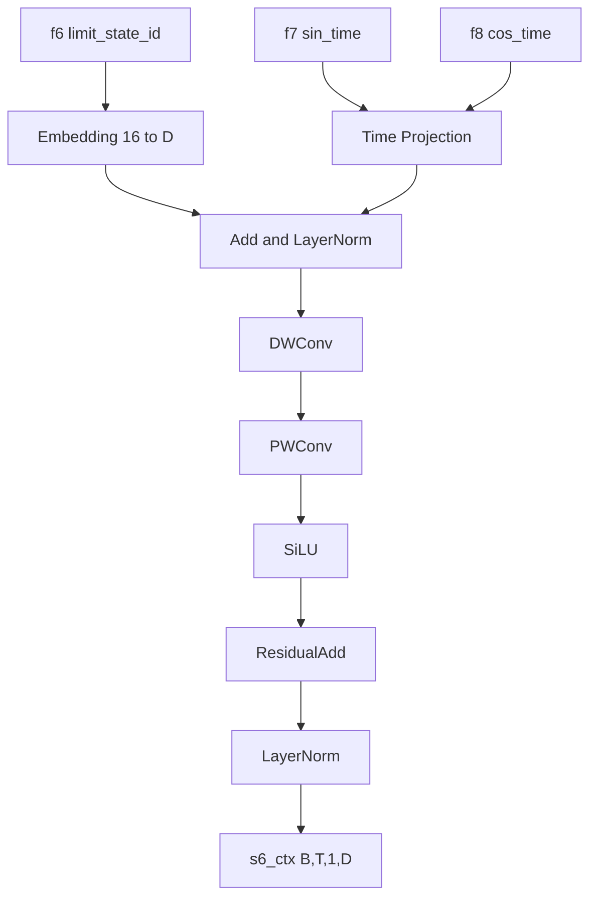

### PriceLiquidityDualFusion

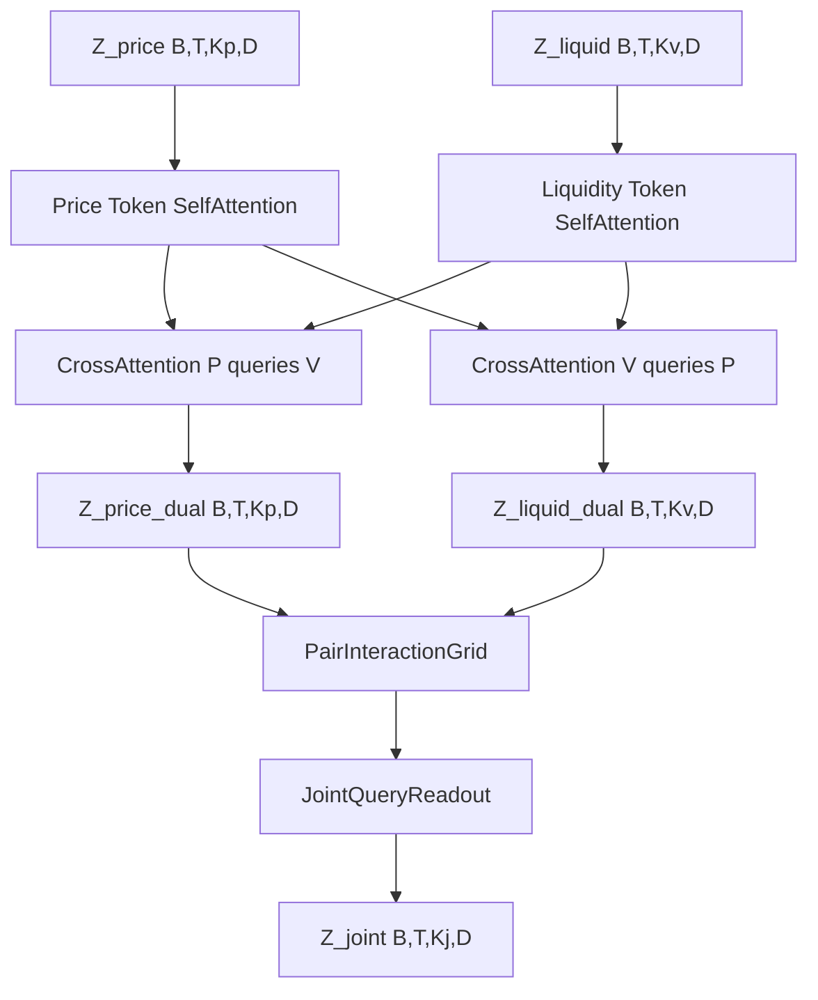

### StateQueryJointReader

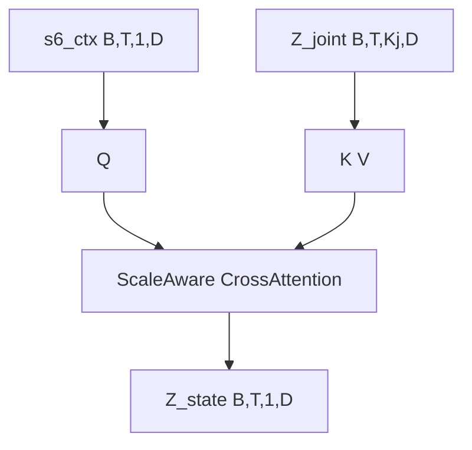

### ScaleAware Window Policy

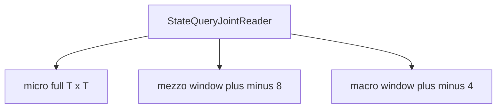

### SidechainContextEncoder

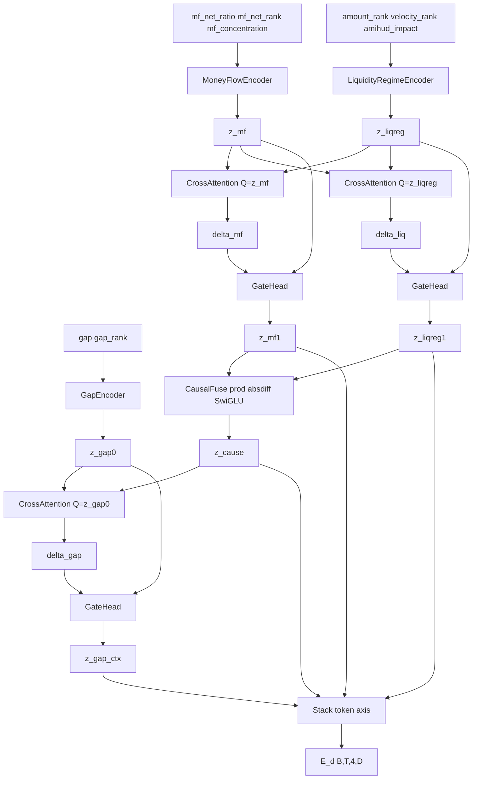

### GapEncoder

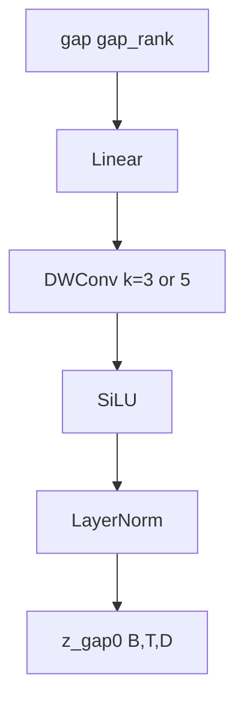

### MoneyFlowEncoder

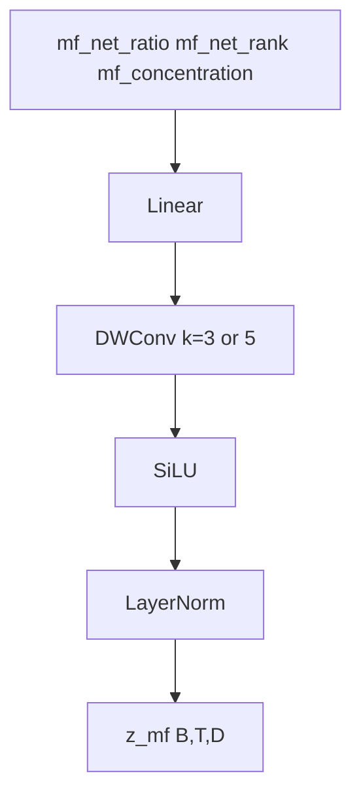

### LiquidityRegimeEncoder

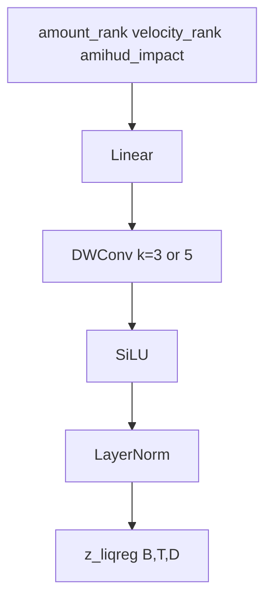

### Sidechain CausalFuse

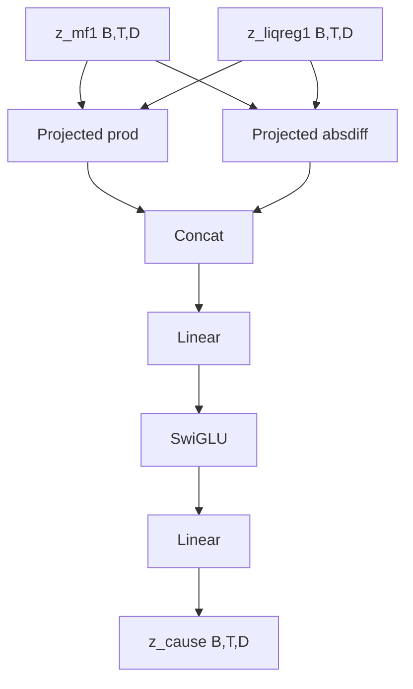

## Cross-Scale Fusion

Each scale first runs the full single-scale frontend independently, producing
its own `J_*` and `Z_state_*`. Only after that does the model enter the
cross-scale fusion stage below.

The cross-scale route is intentionally asymmetric:

```text
macro -> mezzo
mezzo -> micro
micro -> mezzo
FFN on mezzo
```

Interpretation:

- `macro -> mezzo`: macro provides regime / stage anchor to mezzo.
- `mezzo -> micro`: mezzo tells micro what local detail is worth reading.
- `micro -> mezzo`: micro writes decisive fine-grained evidence back to mezzo.
- final fusion and readout stay on mezzo.

This avoids:

```text
macro <-> micro direct attention
three-scale all-to-all attention
full dense micro -> mezzo writeback
```

### Cross-Scale Inputs

```text
J_macro : [B, Ta, Ka, D]
J_mezzo : [B, Tm, Km, D]
J_micro : [B, Ti, Ki, D]

Z_state_macro : [B, Ta, 1, D]
Z_state_mezzo : [B, Tm, 1, D]
Z_state_micro : [B, Ti, 1, D]

E_d : [B, Td, 4, D]
```

### Cross-Scale Flow

```text
Jm0 = J_mezzo
Ji0 = J_micro
Ja0 = J_macro
```

```text
cond_A2M = MLP([Pool(E_d), Pool(Z_state_macro), Pool(Z_state_mezzo)])
Jm1 = Jm0 + g_A2M ⊙ CA(q=AdaLN(Jm0, cond_A2M), kv=Ja0)
```

```text
cond_M2I = MLP([Pool(E_d), Pool(Z_state_mezzo), Pool(Z_state_micro)])
Ji1 = Ji0 + g_M2I ⊙ CA(q=AdaLN(Ji0, cond_M2I), kv=Jm1)
```

```text
J_micro_sig = LocalTopKCrossReadout(
  q      = Jm1,
  kv     = Ji1,
  cond   = [E_d, Z_state_mezzo, Z_state_micro],
  window = local aligned micro window,
  k      = top-k
)
```

```text
cond_I2M = MLP([Pool(E_d), Pool(Z_state_micro), Pool(Z_state_mezzo)])
Jm2 = Jm1 + g_I2M ⊙ CA(q=AdaLN(Jm1, cond_I2M), kv=J_micro_sig)
```

```text
cond_FFN = MLP([Pool(E_d), Pool(Z_state_mezzo)])
J_fused = Jm2 + g_FFN ⊙ FFN(AdaLN(Jm2, cond_FFN))
```

### MacroToMezzoAdapter

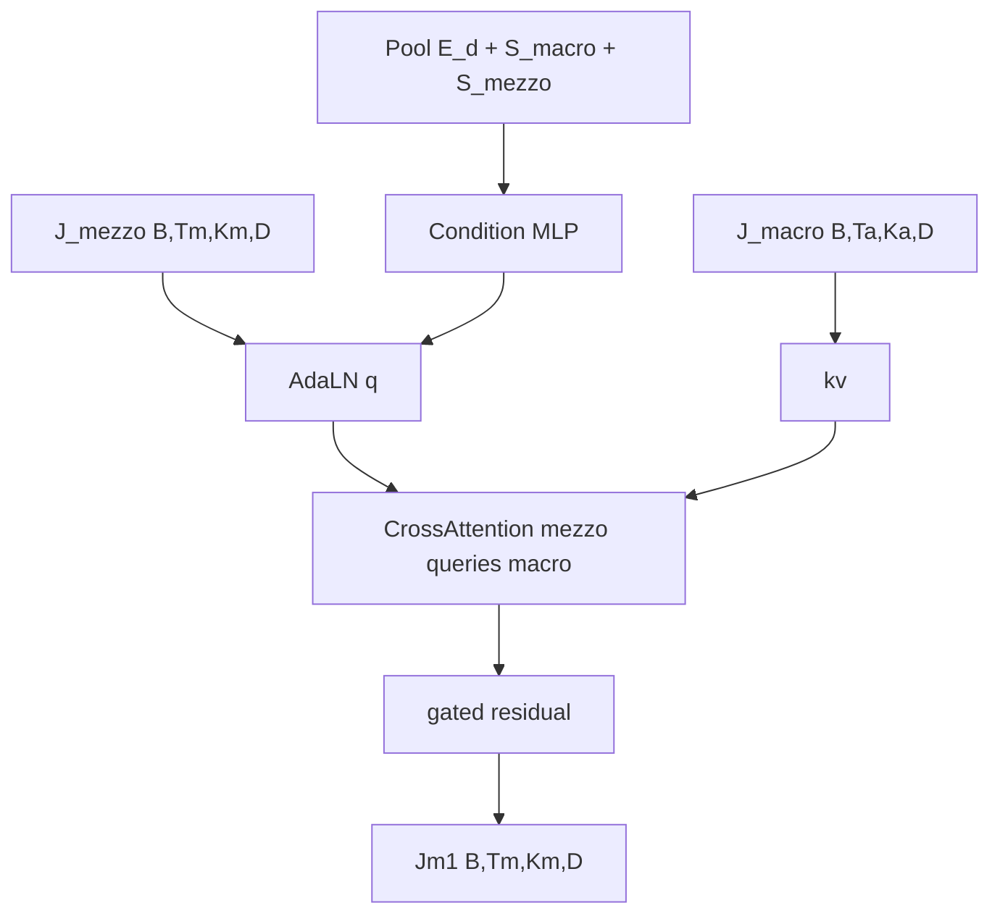

### MezzoToMicroAdapter

```mermaid
flowchart TD
  A["Jm1 B,Tm,Km,D"] --> B["kv"]
  C["J_micro B,Ti,Ki,D"] --> D["AdaLN q"]
  E["Pool E_d + S_mezzo + S_micro"] --> F["Condition MLP"]
  F --> D
  D --> G["CrossAttention micro queries mezzo"]
  B --> G
  G --> H["gated residual"]
  H --> O["Ji1 B,Ti,Ki,D"]
```

### LocalTopKCrossReadout

```mermaid
flowchart TD
  A["Jm1 B,Tm,Km,D"] --> Q["mezzo queries"]
  B["Ji1 B,Ti,Ki,D"] --> W["local aligned window"]
  C["Pool E_d + S_mezzo + S_micro"] --> S["score MLP"]
  Q --> S
  W --> S
  S --> T["Top-k select"]
  Q --> CA["CrossAttention on selected micro tokens"]
  T --> CA
  CA --> O["J_micro_sig B,Tm,Km,D"]
```

### MicroToMezzoAdapter

```mermaid
flowchart TD
  A["J_micro_sig B,Tm,Km,D"] --> B["kv"]
  C["Jm1 B,Tm,Km,D"] --> D["AdaLN q"]
  E["Pool E_d + S_micro + S_mezzo"] --> F["Condition MLP"]
  F --> D
  D --> G["CrossAttention mezzo queries decisive micro"]
  B --> G
  G --> H["gated residual"]
  H --> O["Jm2 B,Tm,Km,D"]
```

### MezzoFusionFFN

```mermaid
flowchart TD
  A["Jm2 B,Tm,Km,D"] --> B["AdaLN"]
  C["Pool E_d + S_mezzo"] --> D["Condition MLP"]
  D --> B
  B --> E["FFN"]
  E --> F["gated residual"]
  F --> O["J_fused B,Tm,Km,D"]
```

## Prediction Heads

The first version should expose three prediction families:

```text
ret
one configured p_q per run
rv
```

Training is **single-target, single-task**:

- one run trains `ret`
- or one run trains `rv`
- or one run trains one chosen quantile `p_q`

Head input:

```text
H = Pool(J_fused)
```

Shared head stem:

```text
H
-> Linear
-> SwiGLU
-> Linear
-> H_head
```

### ret Head

```text
[H_head]
-> Linear
-> ret_mu

[H_head]
-> Linear
-> ret_log_sigma2

ret_sigma2 = exp(ret_log_sigma2)
```

`ret_mu` is the mean in **log-return-ratio space**:

```text
z_ret = log(label_ret)
```

### rv Head

```text
[H_head]
-> Linear
-> rv_log_var

[H_head]
-> Linear
-> rv_log_sigma2

rv_var_hat = exp(rv_log_var)
rv_hat = exp(0.5 * rv_log_var)
rv_sigma2 = exp(rv_log_sigma2)
```

`rv_log_var` is the forecasted **log realized variance**, not the auxiliary uncertainty.

### Quantile Head

For one configured quantile `q` in each run:

```text
[H_head]
-> Linear
-> p_mu_raw[q]

[H_head]
-> Linear
-> p_log_b[q]

p_mu[q] = softplus(p_mu_raw[q]) + eps
p_b[q]  = exp(p_log_b[q])
```

Recommended first enabled set:

```text
Q = {0.01, 0.05, 0.10, 0.25, 0.50, 0.75, 0.90, 0.95, 0.99}
```

The dense `p01..p99` grid can be enabled later without changing the head family, but each run still activates only one `p_q`.

### Head Graph

```mermaid
flowchart TD
  A["J_fused B,Tm,Km,D"] --> B["Pool"]
  B --> C["Shared Head Stem Linear SwiGLU Linear"]

  C --> D1["ret_mu"]
  C --> D2["ret_log_sigma2"]

  C --> E1["rv_log_var"]
  C --> E2["rv_log_sigma2"]

  C --> F1["p_mu_raw[q]"]
  C --> F2["p_log_b[q]"]
```

## Losses

All tasks follow the same pattern:

```text
L_total = L_main + lambda * L_NLL
```

The auxiliary `NLL` term must use a **detached** mean / location target so the model cannot reduce the total loss by only inflating scale:

```text
mu_for_nll = stop_gradient(mu)
```

### ret Loss

For `ret`, predict:

```text
mu       = ret_mu
s        = ret_log_sigma2
sigma2   = exp(s)
target y = label_ret
z        = log(y)
```

Use correlation in log space as the main objective:

$$
L^{ret}_{main} = 1 - \mathrm{Corr}(\mu, z)
$$

Use log-Gaussian NLL as the auxiliary term:

$$
\mathrm{NLL}^{ret}
=
\frac{1}{2}s
+
\frac{1}{2}e^{-s}\bigl(z-\mathrm{stopgrad}(\mu)\bigr)^2
$$

Total loss:

$$
L^{ret}_{total}
=
L^{ret}_{main}
+
\lambda_{ret}\,\mathrm{NLL}^{ret}
$$

### rv Loss

For `rv`, predict:

```text
log_var_hat = rv_log_var
var_hat     = exp(log_var_hat)
s           = rv_log_sigma2
sigma2      = exp(s)
target y = label_rv
v        = y^2
z_v      = log(v)
```

Use QLIKE on the forecasted realized variance as the main objective:

$$
L^{rv}_{main}
=
\log(\hat v) + \frac{v}{\hat v}
=
\text{log\_var\_hat} + v\,e^{-\text{log\_var\_hat}}
$$

Important:

- `QLIKE` uses the forecasted variance level `var_hat`
- it does **not** use the auxiliary uncertainty `sigma2`

Use Gaussian NLL on log realized variance as the auxiliary term:

$$
\mathrm{NLL}^{rv}
=
\frac{1}{2}s
+
\frac{1}{2}e^{-s}\bigl(z_v-\mathrm{stopgrad}(\text{log\_var\_hat})\bigr)^2
$$

Total loss:

$$
L^{rv}_{total}
=
L^{rv}_{main}
+
\lambda_{rv}\,\mathrm{NLL}^{rv}
$$

### Quantile Loss

For one chosen quantile `q`, predict:

```text
mu_q
log_b_q
b_q
target y = label_ret
z      = log(y)
```

Define the log residual:

$$
u_q = z - \log(\hat{\mu}_q)
$$

Main loss:

$$
\rho_q(u_q)=\max(q\,u_q,\ (q-1)\,u_q)
$$

$$
L^{q}_{main}=\rho_q(u_q)
$$

Auxiliary Log-ALD term:

$$
\mathrm{NLL}^{q}
=
\log(b_q)
+
\frac{\rho_q\!\left(z-\log(\mathrm{stopgrad}(\hat{\mu}_q))\right)}{b_q}
$$

Total loss:

$$
L^{q}_{total}
=
L^{q}_{main}
+
\lambda_{q}\,\mathrm{NLL}^{q}
$$

There is no multi-task weighted sum in the first version. One run trains exactly one target.

## Config Cleanup Notes

After the training stack is migrated to single-target `ret / rv / p_q`, the old task-specific config knobs should be removed:

```text
persist_theta
persist_tau
student_t_nu
uncertainty_floor
uncertainty_loss_weight
persist_probability_loss_weight
edge_huber_beta
persist_logit_huber_beta
downrisk_log_huber_beta
freeze_scale_s0_S
freeze_scale_s0_M
freeze_scale_s0_MDD
freeze_scale_s0_RV
```

Recommended replacement group:

```text
ret_nll_weight
rv_nll_weight
quantile_nll_weight
quantile_set
variance_eps
variance_log_clamp_min
variance_log_clamp_max
active_target
active_quantile
```

## Open Points

Still intentionally unresolved:

1. `Kp` in path pooling.
2. `Kv` in liquidity pooling.
3. `Kj` in joint token readout.
4. `Ks` in shared side latent.
5. `k` in `LocalTopKCrossReadout`.
6. Exact local window definition for `micro -> mezzo` readout.
7. Whether `f5` Fourier frequencies should remain fixed or become learnable.
8. Whether `f5` needs any later tail compression beyond `SymLog`.
9. Exact quantile set to enable in the first training run.
